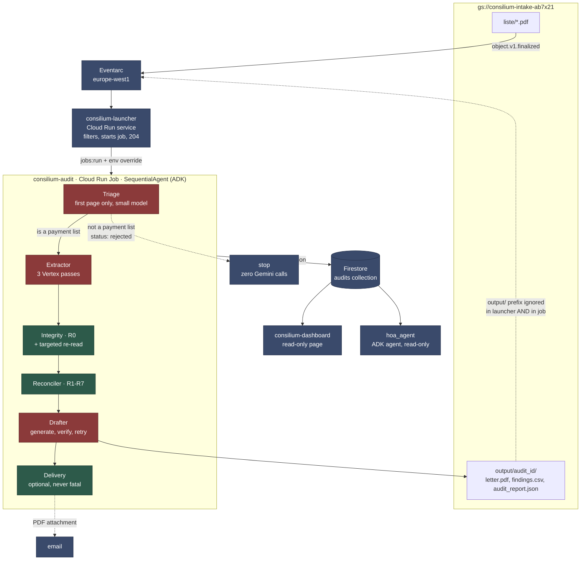

# Consilium

Audits *liste de plată* (monthly payment lists) issued by Romanian *asociații de
proprietari* (homeowners' associations). You drop a PDF into a bucket; you get
back the findings, the coverage report, and the formal document request, on the
correct legal basis.

**Live inspection page:** https://consilium-dashboard-aq2ftfgfkq-ew.a.run.app

> **The system's output is Romanian by design.** The generated letter is a legal
> document addressed to a Romanian homeowners' association, the findings quote
> Romanian statute, and the amounts use Romanian number formatting
> (`1.234,56 lei`). This README is in English; everything the pipeline produces
> is not, and should not be. Verbatim program output and quoted letter fragments
> below are left untranslated for that reason.

---

## 1. The problem

The building administrator posts the *listă de plată* on the notice board. An
owner has 10 days from that posting to contest how their share was calculated
(art. 28 alin. (3) of Law 196/2018), and the association president is then
obliged to answer in writing within another 10 days.

In practice nobody checks the arithmetic. The list is 28 rows × 15 columns with
eight different allocation keys, and anyone who wanted to verify it would need to
know that heating is split by *cotă indiviză* (undivided ownership share),
sanitation by headcount, and that late-payment penalties may not exceed 0.2% per
day. The deadline passes, the right lapses, and next month starts over.

---

## Beyond Romanian HOAs

Consilium is not a tool for homeowners' associations. It is an architecture for
a class of problem: **a financial document issued by a party with an interest in
erring in its own favour, sent to a recipient who has a legal window to contest
it and no practical ability to check it.**

The three properties that define the class are what the architecture is built
around. The issuer controls the arithmetic. The recipient is not an accountant.
The right to object expires.

Romania is the first vertical because it is the problem I have. The same shape
appears elsewhere:

- **Utility bills.** A metered quantity, a tariff, and a total the customer is
  not equipped to re-derive. Most jurisdictions give a fixed window to dispute a
  bill before it is treated as accepted, and the meter reading that would settle
  the question is frequently absent from the invoice.
- **Medical bills and explanation-of-benefits statements.** Itemised charges
  against coverage rules the patient has never read, where the appeal window is
  counted from the date of the statement rather than from the date the patient
  understood it.
- **Insurance claim settlements.** A loss adjuster's breakdown of what is
  covered, depreciated and excluded, issued by the party that pays. Policies
  typically fix a period for contesting the settlement, after which acceptance
  is presumed.
- **Supplier invoices to small businesses.** Volume discounts, indexation
  clauses and pass-through fees applied by the supplier's own system, where the
  contractual objection period is short and the recipient has no finance function.

### What changes for a new vertical

- **The Pydantic schema.** Different documents have different line items. What
  stays is the shape: a set of declared totals, a set of allocated lines, and a
  per-recipient breakdown.
- **The rules in `config.yaml`.** R1–R7 encode Romanian HOA arithmetic. A
  utility bill's rules are different rules over the same kind of structure.
- **The legal basis.** Article references, contestation windows and escalation
  paths are configuration, not code. That separation exists precisely because
  they are the part that does not transfer.

### What does not change

- **R0.** The arithmetic cross-validation is universal, because it does not
  encode any domain knowledge. It exploits a property every financial document
  has: it contains its own redundancy. Rows sum to totals, columns sum to
  declared amounts, and a transcription error breaks that redundancy in a way
  the issuer's own document proves. R0 needs no rule about heating or coverage
  tiers, only that the numbers were supposed to add up.
- **The model/deterministic split.** A model transcribes; ordinary code decides.
  The reason is the same in any vertical where the output is an accusation
  somebody will contest.
- **The claim validator.** Every sentence in the generated letter maps to a
  computed finding, and every amount comes from one. That constraint is
  domain-independent; only the findings change.
- **The coverage report.** What could not be verified, and which document would
  settle it. Every vertical has its version of "we could not check this without
  the supplier's invoice", and every vertical has the same failure mode if it
  stays silent about it.

The verticals differ in their vocabulary. They do not differ in the property
that makes the problem hard: the recipient is being asked to trust arithmetic
performed by the party that benefits from it.

---

## 2. Architecture



**Red = touches a model. Green = deterministic, no network.**

| stage | model | what it does | typical duration |
|---|---|---|---|
| Triage | Gemini 2.5 Flash-Lite | first page only: is this a payment list at all? | 4 s |
| Extractor | Gemini 3.5 Flash, Vertex, `location=global` | transcribes PDF → validated Pydantic | 82 s |
| Integrity (R0) | **none** | checks the arithmetic of the transcription; targeted re-read only on failure | 0.03 s |
| Reconciler (R1–R7) | **none** | the audit rules + the coverage report | 0.11 s |
| Drafter | Gemini 3.5 Flash | writes the letter, verified programmatically | 27 s |
| Delivery | **none** | emails the letter as a PDF attachment, if configured | 1 s |

The targeted re-read inside Integrity does call the model, but **only when R0
fails**. On a native document, zero calls.

**The triage gate exists because extraction is expensive.** A PDF that is not a
payment list would otherwise burn 82 seconds of Gemini to fail schema validation
at the end. A small model looks at the first page and decides first: measured on
a real AGA decision, rejected in 3.95 s with zero extractor calls.

The gate **fails open**. If the triage model is unavailable, misbehaves or is
unconfigured, the pipeline continues. A cost optimisation that can block a valid
audit costs more than the seconds it saves. Rejected documents get status
`rejected`, not `failed`, because correct routing is not an error.

Gemma would have been the natural choice by size. It is not callable serverless
on Vertex for this project: every variant returns 404 (gemma-2 and gemma-3, 1b
through 7b, both naming conventions, in `global`, `us-central1` and
`europe-west4`). Vertex serves Gemma only through a self-deployed GPU endpoint,
which would cost more than the Flash seconds it saves. The model is a config key,
so switching to a Gemma endpoint later is one line.

**Delivery is optional and cannot fail an audit.** It is disabled unless both a
recipient and an API key are present; transport errors, provider rejections and
a missing attachment all come back as a recorded failure while the audit status
stays `done`. The API key lives in Secret Manager, never in the job spec or the
repository.

### The rules

| | check | basis |
|---|---|---|
| **R0.row** | Σ charges + arrears + penalties == total due | transcription coherence |
| **R0.column** | Σ across apartments == the category's declared amount | transcription coherence |
| **R1** | Σ expense lines == declared grand total | |
| **R2** | Σ *cote indivize* == 100% | Law 196/2018 |
| **R3** | every expense allocated per its declared key | Law 196/2018 |
| **R4** | penalties ≤ 0.2%/day of arrears | art. 77 alin. (2) |
| **R5** | Σ current-month charges across apartments == grand total | |
| **R6** | apartment count found == count declared | |
| **R7** | is the contestation window still open? | art. 28 alin. (1)/(3)/(4) |

**R5 subtracts arrears and penalties from the total due.** Those are history, not
current-month allocated expense; compared directly against the grand total they
would produce a false finding on any correct list where somebody owes money.

**R3 makes two checks, not one.** Per apartment, |deviation| ≤ 0.05 lei. Across
the whole column, Σ of deviations ≈ 0. The second one is what matters: genuine
rounding cancels out, and a per-apartment threshold on its own lets through
anyone shaving 0.03 lei off each of 28 apartments. The test
`test_r3_catches_skimming_under_the_per_apartment_threshold` builds exactly that
case: no individual cell looks abnormal, 0.80 lei moved, caught as
`systematic_distribution_drift`.

**R7 takes its reference date as an injected parameter**, not from the clock. A
rule about deadlines that depends on when it runs is no longer reproducible.

---

## 3. Why the sub-agents are `BaseAgent`, not `LlmAgent`

The pipeline is an ADK `SequentialAgent` with four sub-agents. Three of them
(`Integrity`, `Reconciler`, and the orchestration inside `Drafter`) are custom
`BaseAgent` subclasses running ordinary Python. Only `Extractor` and the
generation step inside `Drafter` touch a model.

The argument has three parts.

**An audit finding has to be reproducible.** The generated letter lands in front
of an administrator with every incentive to attack it. "Apartamentul 17:
penalizare de 141,18 lei la o restanță de 1.120,45 lei, adică 0,42%/zi, față de
plafonul de 67,23 lei" must come out identical on every run and must be
explainable line by line. An `LlmAgent` handed the table and told to "find the
problems" does not provide that, not even at temperature zero, because the
formulation of the rule itself becomes negotiable.

**Arithmetic is not a language task.** R1–R6 are subtractions and comparisons
against a tolerance. A model executing them introduces a class of error that
otherwise does not exist, in exchange for zero additional capability. Development
confirmed this from the opposite direction: the extractor is explicitly forbidden
to compute, and every financial error in the entire project came from
transcription, not from reasoning.

**The decomposition is real.** The sub-agents are not a disguised `if/else`: each
has its own input/output contract, its own entry in `step_log`, its own failure
mode, and its own slot in ADK session state. `Integrity` can declare an apartment
unauditable, and `Reconciler` then excludes it from the rules that touch that
field, but not from the others. The benefits of ADK (sequencing, event log,
shared state, observability) are obtained in full without pretending that a
subtraction is an act of intelligence.

`Drafter` is also a `BaseAgent`, because the generate → verify → retry-with-the-
violation-list loop cannot be expressed as a prompt. See section 4.2.

---

## Why not just a chatbot?

The obvious objection to all of this: drop the PDF into a chat window with a
good model and ask it to find the errors. `tools/baseline_chat.py` does exactly
that, with the same model as the extractor (`gemini-3.5-flash`), one call, default
temperature, and the prompt a person would actually type:

> *"Verifică această listă de plată, găsește erorile și redactează o cerere
> formală către asociație."*

Five runs per document, scored against the same `expected_findings.json` the
pipeline is scored against. Two thresholds are measured separately, because
they are not the same skill:

- **identified**: the answer points at the right thing ("apartment 17's penalty
  looks too high"). The low bar.
- **quantified**: the answer produces the figure the reconciler computes
  ("57,60 lei above the legal cap"). That number appears nowhere in the
  document; it has to be derived.

| document | identified | quantified | invented findings | ungrounded figures | distinct answers in 5 runs |
|---|---|---|---|---|---|
| `sample_errors` (3 planted) | **2.8 / 3** | 1.6 / 3 | 1.2 | 6.6 | 2 |
| `sample_penalties` (4 planted) | **3.4 / 4** | **0.2 / 4** | 1.2 | 11.8 | 2 |
| `sample_clean_scanned` (0 planted) | n/a | n/a | **2.4** | 3.6 | 1 |

**Where the baseline does well, and it does:** it finds things. On
`sample_penalties` it identified 3.4 of 4 planted findings on average, and four
of five runs quoted all three abusive penalty amounts (`96,00`, `18,72`,
`141,18`) correctly. On `sample_errors` it caught the inflated grand total in
every single run. As a *reading* device pointed at a document, it is good.

**Where it stops being an audit:**

*It notices but does not compute.* On `sample_penalties` it quantified 0.2 of 4.
It reports "the penalty is 96,00 lei", a number printed in the document, but
almost never produces "57,60 lei charged above the legal cap", which requires
knowing the cap, applying it to the arrears, and subtracting. The owner needs
the second number to file a contestation. The first one they could read
themselves.

*It invents findings on a correct document.* `sample_clean_scanned` has zero
planted errors. Every run reported problems anyway: 2.4 rule categories per
run, in confident, well-formatted Romanian.

*And it cannot tell its own misreading from a defect in the document.* This is
the one that matters. From run 3 on the clean scan, verbatim:

```
#### 1. Eroare de calcul la consumul de apă (Ap. 3)
*   Index vechi:      347,2 mc
*   Index nou:        353,0 mc
*   Consum real:      353,0 - 347,2 = 5,8 mc
*   Consum înregistrat în tabel: 5,6 mc (eroare de 0,2 mc în minus...)
```

The document says **347,4**, not 347,2. The model misread one digit off the
scan, did correct arithmetic on its own wrong input, and concluded that the
association had understated a meter reading. Everything downstream of that (the
formal letter, the accusation, the requested correction) is built on a digit
that was never there.

That failure is not fixable with a better prompt, because the model has no
independent check on its own reading. It is what **R0** exists for: on the same
document, the pipeline's extractor also misread a cell (apartment 7, `Apă caldă
menajeră`), R0 caught it because the row stopped summing to its printed total,
the targeted re-read disagreed with the first reading, and the cell was marked
unauditable instead of becoming an accusation. **Zero false audit findings.**

*Finally, the answer changes between runs.* Same document, same prompt, five
runs, two different sets of findings on both error samples. A letter that names
different problems depending on when you asked is not something you send to an
administrator.

Reproduce with:

```bash
PYTHONPATH=. .venv/bin/python tools/baseline_chat.py --runs 5
PYTHONPATH=. .venv/bin/python tools/baseline_chat.py --reeval samples/baseline_chat.json
```

The second form rescores saved answers without spending API calls. Two caveats
on the measurement, both visible in the code: "identified" is keyword-based and
therefore generous, and "ungrounded figures" only checks whether a number
appears *somewhere* in the document, which is why the fabricated `347,2` above
counts as grounded. Both biases favour the baseline.

---

## 4. Two findings

### 4.1. Self-reported confidence does not detect reading errors

The extractor has an explicit instruction: anything illegible or ambiguous goes
into `low_confidence_fields`, never guessed. To test that, the generator also
produces degraded variants of the three samples: 150 dpi rasterization, random
skew of ±1.5°, Gaussian noise σ=4, JPEG compression at q=75, repackaged as a PDF
with no text layer (`pdftotext` returns 3 bytes). Deterministic: the same seed
yields the same MD5.

Result across the three scans:

| document | fields | errors | fidelity | `low_confidence_fields` |
|---|---|---|---|---|
| `sample_clean_scanned` | 513 | 2 | 99.610% | **0** |
| `sample_errors_scanned` | 457 | 1 | 99.781% | **0** |
| `sample_penalties_scanned` | 513 | 0 | 100.000% | 0 |

**All three errors passed silently.** The model did not perceive those cells as
illegible, it perceived them as legible and got them wrong. The worst one:
apartment 7, column "Apă caldă menajeră", 41,80 lei read as 34,20, the value
from apartment 5's row, picked up because of the skew. The row's `total_due` was
still correct, so the breakdown no longer summed to the total: **an audit false
positive caused by scanning**, indistinguishable from a fraudulent allocation.

A model's introspection about its own confidence is not a usable detector. The
replacement is arithmetic redundancy: **R0**, run immediately after extraction,
before any audit.

On the three native documents R0 comes back clean: 28 rows and 8 columns checked,
zero false positives. On the scans:

```
sample_clean_scanned:
  [R0.row]    Apartamentul 7: suma defalcării (891.33) nu dă totalul de plată
              tipărit (898.93); diferență -7.60 lei.
  [R0.column] Coloana „Apă caldă menajeră”: suma pe apartamente (3218.60) nu dă
              suma declarată în tabelul de cheltuieli (3226.20); diferență
              -7.60 lei.
  → localized cell: apartment 7 × „Apă caldă menajeră” (-7.60 lei)
```

When a row and a column both fail by **the same difference**, their intersection
localizes a single cell. The targeted re-read cost **one call**: the right page
rendered at 300 dpi, with the response narrowed to that cell. The second reading
returned 41,80, the correct value.

The policy is conservative and does not adopt the second reading: two readings
that disagree mean we do not know which one is right. Apartment 7 is marked
unauditable, the cell goes into `low_confidence_fields`, R3 on that category
becomes "partial", and R2/R4/R5/R6 stay "verified". One uncertain field does not
void the whole audit.

**Zero false audit findings on the scans.** R0 caught 2 out of 2 silent financial
errors.

### 4.2. The letter validator found a bug in the validator, not in the model

The drafter receives findings that have already been computed. The constraint: no
invented amount, no invented finding. `verify_letter()` rejects four classes of
violation: an amount that appears in no finding, a paragraph pointing at a
non-existent finding, a misattributed `rule_id`, and a finding omitted or cited
twice. The loop is generate → verify → retry with the violation list, at most 3
attempts. **No unvalidated letter is ever emitted.**

The test `test_recomputed_amount_is_rejected` checks something stronger than it
looks: it rejects an amount the model computed *correctly*. Provenance is what
counts, not correctness. If the reconciler did not produce it, it does not go
into the letter.

During development the mechanism fired for real. Three attempts rejected in a
row:

```
DrafterError: scrisoarea nu a trecut verificarea după 3 încercări:
  suma 470,67 nu provine din nicio constatare calculată;
  suma 485,75 nu provine din nicio constatare calculată
```

The model had invented nothing. Both figures were inside the R3 finding's
`message`: *"cea mai mare abatere: apartamentul 3, +470.67 lei față de 485.75
lei"* ("largest deviation: apartment 3, +470.67 lei against 485.75 lei"),
produced by the reconciler, deterministic, verifiable. My allowlist scanned only
`expected_value`, `found_value` and `amount_involved`, not the text of the
explanation. The validator was right to reject and wrong in its definition of
provenance.

The fix: `amounts_in()` also extracts amounts from reconciler-generated text
(which formats them with a decimal point rather than a comma). A strict validator
that fails *closed* shows you where your own definition is incomplete, instead of
letting the letter out.

The same pattern showed up a second time, on the legal side. The first version of
the letter asserted, on its own, *"termenul legal de 10 zile prevăzut de art. 28"*
("the legal 10-day deadline provided by art. 28"). The validator checks amounts
and `rule_id`s, so a legal assertion escapes it by construction. Art. 28 in fact
contains three distinct grounds: alin. (1) grants the right to copies **with no
deadline attached**, alin. (3) grants 10 days to contest from the posting date
plus 10 days to answer, and alin. (4) grants escalation to the local authority
after 10 days without resolution. All three now live in `config.yaml` under
`legal:`, chosen by a human, and R7 decides which one applies.

---

## 5. Setup from scratch

### Local prerequisites

```bash
python3.13+          # developed on 3.14
poppler-utils        # pdftoppm, for the targeted re-read
fonts-liberation     # Romanian diacritics in the PDFs
gcloud CLI           # authenticated, with ADC
```

```bash
git clone <repo> && cd consilium
python -m venv .venv && .venv/bin/pip install -r requirements.txt
.venv/bin/pip install pytest ruff Pillow numpy   # tests and generator only
gcloud auth application-default login
```

### Generating the synthetic data

```bash
.venv/bin/python tools/gen_samples.py
```

Produces six PDFs in `samples/synthetic/` (three native, three scanned) plus
`expected_findings.json`, which documents every planted error with id, type,
location, correct value vs. found value, and severity. Deterministic: two
consecutive runs produce the same MD5.

Entirely fictitious data: association "Zefir 12", sector 9 (does not exist),
tax ID 99999999, no owner names anywhere, disclaimer on every page.

### Running locally, without the cloud

```bash
# extraction (requires Vertex)
.venv/bin/python -m consilium.extractor samples/synthetic/sample_errors.pdf \
    -o samples/extracted/sample_errors.json --verify

# R0 + targeted re-read over an existing extraction
PYTHONPATH=. .venv/bin/python tools/run_integrity.py \
    samples/extracted/sample_clean_scanned.json \
    samples/synthetic/sample_clean_scanned.pdf

# transcription fidelity against the generator's ground truth
.venv/bin/python tools/check_extraction.py samples/extracted/sample_clean.json
```

### Deploy

```bash
bash scripts/deploy.sh
```

Overridable variables: `PROJECT`, `REGION`, `BUCKET`, `JOB`, `LAUNCHER`,
`TRIGGER`, `SA_NAME`. The script is idempotent and contains four things that are
not obvious:

**1. `GOOGLE_CLOUD_LOCATION=global`, set explicitly and re-applied.**

```bash
gcloud run jobs deploy consilium-audit --region=europe-west1 \
  --set-env-vars="...,GOOGLE_CLOUD_LOCATION=global,CONSILIUM_VERTEX_LOCATION=global,..."

gcloud run jobs update consilium-audit --region=europe-west1 \
  --update-env-vars="GOOGLE_CLOUD_LOCATION=global,CONSILIUM_VERTEX_LOCATION=global"
```

ADK deploy flows derive `GOOGLE_CLOUD_LOCATION` from `--region`. With
`--region=europe-west1`, the Vertex client would be built against the regional
endpoint instead of `global`, which is where the extractor runs. The override is
mandatory and must be **re-applied after deploy**, because a later deploy can
overwrite it. The second `update` exists for exactly that.

The extractor reads `CONSILIUM_VERTEX_LOCATION`, defaulting to `global`, so the
location is pinned in code rather than inherited, but `GOOGLE_CLOUD_LOCATION`
stays correctly set for any other component that consults it.

**2. The region follows the bucket.** An Eventarc trigger on Cloud Storage must
be in the same location as the bucket. `consilium-intake-ab7x21` is in
`europe-west1`, so job, launcher and trigger all live there.

**3. The Eventarc service agent does not exist on first use.** Creating the
trigger fails with `FAILED_PRECONDITION` until it is provisioned, and the
permissions take minutes to propagate:

```bash
gcloud beta services identity create --service=eventarc.googleapis.com --project=$PROJECT
gcloud projects add-iam-policy-binding $PROJECT \
  --member="serviceAccount:service-${PROJECT_NUMBER}@gcp-sa-eventarc.iam.gserviceaccount.com" \
  --role=roles/eventarc.serviceAgent
```

The script retries trigger creation 20 times at 30-second intervals.

**4. `gcloud storage service-agent` returns the value with a leading newline and
indentation**, which produces an empty `--member=serviceAccount:` and a confusing
`INVALID_ARGUMENT` error. The script builds the address from the project number
instead.

### Triggering an audit

```bash
gcloud storage cp lista.pdf gs://consilium-intake-ab7x21/liste/lista.pdf
```

That's it. Everything else is automatic. To follow along:

```bash
.venv/bin/python -c "
from consilium.state import FirestoreAuditStore
for r in FirestoreAuditStore(project='hoa-agent-ab7x21').list_recent(limit=5):
    print(r.audit_id, r.status, r.period, [f['rule_id'] for f in r.findings])
"
```

Artifacts land in `gs://<bucket>/output/{audit_id}/`: the letter PDF,
`findings.csv`, `audit_report.json`.

### A note on the self-triggering loop

Artifacts are written to the **same bucket** they are read from. Without a
filter, every audit would trigger three more executions, and those would trigger
more. The `output/` prefix is ignored in the launcher **and** in the job, and the
artifact directory is constructed so that it always falls underneath it
(`test_artifact_directory_stays_under_the_output_prefix`). Verified in
production: two uploads, six artifacts written, **two executions total**.

---

### The inspection page

`consilium-dashboard` is a Cloud Run service that reads Firestore and serves the
letter from Cloud Storage. It lists every case with its status, and each case
detail shows the triage verdict, the findings with their amounts and legal
basis, the coverage report, the per-stage timings, the delivery result and the
letter itself.

It is read only by construction, not by convention: a test asserts the app
exposes only `GET` and `HEAD`. An audit starts by putting a PDF in the bucket,
never by pressing a button, so a refresh during a demo cannot launch parallel
processing of the same document. The list auto-refreshes only while something is
running.

### The demo video

The four minute demo is generated rather than filmed:

```bash
PYTHONPATH=. .venv/bin/python tools/narrate.py --voice en-US-Studio-O --out-dir demo/audio_o
PYTHONPATH=. .venv/bin/python tools/record_demo.py
PYTHONPATH=. .venv/bin/python tools/build_demo.py --audio demo/audio_o/manifest.json
```

`demo/storyboard.py` holds the narration and the visual action together, so a
rewritten sentence cannot desynchronise from what is on screen: scene length
comes from the generated audio, never from a hand-written number. The recorder
drives Chromium through Playwright and captures lossless frames, which avoids
the Wayland screen-capture portal entirely and is why the whole thing reruns
unattended. The uploads it performs are real `gcloud` calls against the real
bucket, and one scene runs `gcloud run jobs executions list` live so the claim
that this ran on Google Cloud is visible rather than asserted. The assembler
fits each scene to its narration; a wait filmed in two minutes against a
nineteen second line becomes a speed-up with a badge on screen.

---

## 6. Tests

```bash
.venv/bin/python -m pytest tests/ -q      # 257 tests, ~5 s
.venv/bin/ruff check consilium/ job/ tools/ tests/ hoa_agent/
```

All of them run offline. None calls a model.

| suite | tests | what it guarantees |
|---|---|---|
| `test_delivery.py` | 71 | Delivery is opt-in and cannot fail an audit: half a configuration counts as disabled, transport errors and provider rejections come back recorded rather than raised, and a summary that would quote an uncomputed figure is refused before anything is sent. Also scans every tracked source file for key-shaped strings, with a positive control so the scanner cannot pass by being too narrow. |
| `test_acceptance.py` | 21 | The reconciler finds **every** planted finding on `sample_errors` and `sample_penalties`, and **zero** on `sample_clean`. Each finding checked individually against `expected_findings.json`. Includes the scan acceptance case: R0 catches the bad cell, zero false audit findings, the remaining rules stay verified. |
| `test_reconciler.py` | 26 | ≥2 tests per rule R1–R6. Includes skimming below the per-apartment threshold, the rounding remainder that must **not** fire, a penalty charged with no arrears, and an AST test that structurally verifies `reconciler.py` imports none of `google`, `genai`, `httpx`, `requests`, `urllib`, `socket`, `aiohttp`. |
| `test_letter_rendering.py` | 21 | The letter PDF verified through `pdftotext` rather than by eye, because the visual check is what missed the original defect. Font resolution is never Helvetica, every Romanian glyph survives the round trip, the section heading is not glued to the list numbering, and rendering alters no wording. |
| `test_contestation_window.py` | 19 | R7 across every state of the window: open, last day, expired, missing posting date, missing reference date. Plus letter-mode selection and the prohibition on invoking alin. (3) after expiry. |
| `test_dashboard.py` | 17 | The inspection page is read only, enforced structurally by asserting the app exposes only GET and HEAD. Rejected audits explain the decision, a clean document says so rather than showing nothing, record content is escaped, and a missing audit is 404 rather than a cheerful 200. |
| `test_job_filter.py` | 16 | The anti-loop filter. `output/` never reprocessed, non-PDFs ignored, but `liste/output/x.pdf` still processed (prefix, not substring). Every audit gets its own directory. |
| `test_drafter.py` | 14 | No invented amount, including one that was *correctly recomputed*. No invented, misattributed, omitted or duplicated finding. Romanian money-format parsing. |
| `test_triage.py` | 12 | The entry gate accepts, rejects, and above all fails open: a model error, an unreadable PDF, an invalid response and a disabled gate all let the document through. Disabled triage never calls the model at all. |
| `test_integrity.py` | 12 | R0 on rows and columns, tolerances, cell localization by intersection, the ambiguity that must **not** be localized, the conservative resolution without a re-read, fail-fast on incomplete config. |
| `test_state.py` | 11 | Idempotency: the same file reprocessed neither duplicates the document nor resets its state. Monthly history via `association_ref`. Failures persisted with their reason. Artifacts not duplicated on retry. |
| `test_extractor_join.py` | 9 | Deterministic alignment of column headers to category labels. Ambiguous or unknown matches reported, never forced. Values never altered. |
| `test_pipeline_gate.py` | 8 | The gate inside the full pipeline, offline. A rejected document never reaches the extractor, a failing stage stops the ones after it, and an unavailable triage runs the whole thing anyway. | Deterministic alignment of column headers to category labels. Ambiguous or unknown matches reported, never forced. Values never altered. |

The acceptance suite caught two real bugs during development, both false
positives on the clean document: aggregate drift fabricated by rounding each
deviation before summing, and cross-category contamination from a prefix match in
`suspect_charge`.

---

## 7. Known limitations

**Text fields escape R0.** R0 is an arithmetic check, so it only covers fields
that participate in a sum. On `sample_clean_scanned`, the invoice reference
`FT-2025-11-000877` was read as `FF-2025-11-000877`, a T/F confusion at 150 dpi,
and no check of this kind can flag it. The practical consequence is limited
(the reference is used to request the document, not in calculations), but an
invoice code transcribed from a scan can be off by one letter. Covering it would
require a second source, not another rule.

**Without a consumption annex, 2 of 8 expense lines are unverifiable.**
Consumption-based allocation cannot be checked if the document does not publish
individual meter readings. On `sample_errors` that means 6 of 8 lines verified
and 4.749,95 lei left unaudited. It does not vanish quietly: it goes into
`coverage_report` with the reason, and the letter explicitly requests the annex.
The schema has an optional `consumption` field. If the document carries it, the
line becomes verifiable.

**The structural blind spot: inflated invoices, correctly allocated.** R1–R6 only
check the list's internal coherence. If the administrator declares 14.500 lei for
heating when the invoice says 12.000, and allocates it correctly by *cotă
indiviză*, everything balances and the audit has nothing to report. That is why
`documents_to_request` **always** includes the supplier invoices, even on a clean
document. An audit that does not declare its blind spots is worse than one that
does not run, because the owner believes everything was checked.

**The targeted re-read does not adopt the second reading.** When the two readings
disagree, the row becomes unauditable even if the second one balances. On
`sample_clean_scanned` the second reading was in fact correct (41,80) and was
rejected anyway. Recovering it would require best-of-three; that is not
implemented.

**The re-read crop is page-level, not row-level.** Locating a row's pixel band
would require text positions, which a scanned PDF does not have. The re-read
sends one page per call at 300 dpi, with the response narrowed semantically to a
single cell, row or column. In practice it is enough (the cell was found on the
first call) but it is not a geometric crop.

**The deadlines in `config.yaml` must be confirmed against the text of the law**
before sending a real request. They are configurable precisely because the amount
validator cannot verify a legal assertion.

**Heavy abbreviation is handled by the model, not by the deterministic
aligner.** The generator emits a second, deliberately different layout:
different header wording, reordered columns, abbreviations instead of full
names, expense table after the apartment table, two pages. The extractor reads
it at 100.000% fidelity with no code changes. But the abbreviated column headers
(`A.R.+can.`, `A.C.M.`, `En.term.`, `F.rep.`, `F.rulm.`) are matched to their
canonical categories by the model, which receives the category list from pass 1.
Fed those abbreviations directly, the deterministic prefix aligner resolves only
2 of 8. It recognises `Salubr.` and `Admin.` and reports the rest as unresolved.
The safety net is therefore thinner than the measured result suggests: it catches
what the model gets wrong, but on this class of header it would hand back six
`low_confidence_fields` rather than a silent guess. That is the designed
behaviour, not a defect, but it is not the same as coverage.

---

## Code layout

```
consilium/
  schema.py       the Pydantic contract; zero SDK dependencies
  config.py       thresholds from config.yaml, fail-fast on missing keys
  triage.py       the entry gate; fails open by construction
  extractor.py    PDF → PaymentList; transcribes, does not compute
  integrity.py    R0; deterministic, no network
  reconciler.py   R1–R7 + coverage report; deterministic, no network
  drafter.py      the letter + the validator + the artifacts
  delivery.py     optional email; cannot fail an audit
  state.py        Firestore, `audits` collection; in-memory double for tests
  pipeline.py     ADK SequentialAgent with the six sub-agents
  dashboard.py    the read-only inspection page
job/
  main.py         the Cloud Run Job entry point
  launcher.py     the service that receives the CloudEvent
  entry.py        dispatcher between job, launcher and dashboard roles
hoa_agent/        ADK inspection agent, read-only
tools/
  gen_samples.py     synthetic payment lists, three layouts plus a negative
  check_extraction.py fidelity against the generator's ground truth
  run_integrity.py    R0 and the targeted re-read over a saved extraction
  baseline_chat.py    the one-call chatbot benchmark
  narrate.py          demo narration via Cloud Text-to-Speech
  record_demo.py      demo capture; real uploads, lossless frames
  build_demo.py       fits each scene to its narration and assembles
demo/storyboard.py  narration and visual action, one scene at a time
scripts/deploy.sh
```

`consilium/reconciler.py` and `consilium/integrity.py` import no model SDK and
make no network call. Verified by AST in the tests and by an import blocker
installed into `sys.meta_path`.
