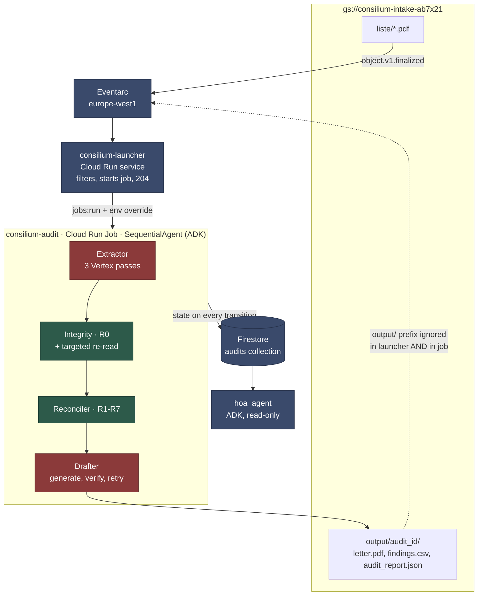

# Consilium

Audits *liste de plată* (monthly payment lists) issued by Romanian *asociații de
proprietari* (homeowners' associations). You drop a PDF into a bucket; you get
back the findings, the coverage report, and the formal document request, on the
correct legal basis.

> **The system's output is Romanian by design.** The generated letter is a legal
> document addressed to a Romanian homeowners' association, the findings quote
> Romanian statute, and the amounts use Romanian number formatting
> (`1.234,56 lei`). This README is in English; everything the pipeline produces
> is not, and should not be. Verbatim program output and quoted letter fragments
> below are left untranslated for that reason.

---

## 1. The problem

The building administrator posts the *listă de plată* on the notice board. An
owner has 10 days from that posting to contest how their share was calculated
(art. 28 alin. (3) of Law 196/2018), and the association president is then
obliged to answer in writing within another 10 days.

In practice nobody checks the arithmetic. The list is 28 rows × 15 columns with
eight different allocation keys, and anyone who wanted to verify it would need to
know that heating is split by *cotă indiviză* (undivided ownership share),
sanitation by headcount, and that late-payment penalties may not exceed 0.2% per
day. The deadline passes, the right lapses, and next month starts over.

---

## 2. Architecture



**Red = touches a model. Green = deterministic, no network.**

| stage | model | what it does | typical duration |
|---|---|---|---|
| Extractor | Gemini 3.5 Flash, Vertex, `location=global` | transcribes PDF → validated Pydantic | 82 s |
| Integrity (R0) | **none** | checks the arithmetic of the transcription; targeted re-read only on failure | 0.03 s |
| Reconciler (R1–R7) | **none** | the audit rules + the coverage report | 0.11 s |
| Drafter | Gemini 3.5 Flash | writes the letter, verified programmatically | 27 s |

The targeted re-read inside Integrity does call the model, but **only when R0
fails** — on a native document, zero calls.

### The rules

| | check | basis |
|---|---|---|
| **R0.row** | Σ charges + arrears + penalties == total due | transcription coherence |
| **R0.column** | Σ across apartments == the category's declared amount | transcription coherence |
| **R1** | Σ expense lines == declared grand total | — |
| **R2** | Σ *cote indivize* == 100% | Law 196/2018 |
| **R3** | every expense allocated per its declared key | Law 196/2018 |
| **R4** | penalties ≤ 0.2%/day of arrears | art. 77 alin. (2) |
| **R5** | Σ current-month charges across apartments == grand total | — |
| **R6** | apartment count found == count declared | — |
| **R7** | is the contestation window still open? | art. 28 alin. (1)/(3)/(4) |

**R5 subtracts arrears and penalties from the total due.** Those are history, not
current-month allocated expense; compared directly against the grand total they
would produce a false finding on any correct list where somebody owes money.

**R3 makes two checks, not one.** Per apartment, |deviation| ≤ 0.05 lei. Across
the whole column, Σ of deviations ≈ 0. The second one is what matters: genuine
rounding cancels out, and a per-apartment threshold on its own lets through
anyone shaving 0.03 lei off each of 28 apartments. The test
`test_r3_catches_skimming_under_the_per_apartment_threshold` builds exactly that
case — no individual cell looks abnormal, 0.80 lei moved, caught as
`systematic_distribution_drift`.

**R7 takes its reference date as an injected parameter**, not from the clock. A
rule about deadlines that depends on when it runs is no longer reproducible.

---

## 3. Why the sub-agents are `BaseAgent`, not `LlmAgent`

The pipeline is an ADK `SequentialAgent` with four sub-agents. Three of them
(`Integrity`, `Reconciler`, and the orchestration inside `Drafter`) are custom
`BaseAgent` subclasses running ordinary Python. Only `Extractor` and the
generation step inside `Drafter` touch a model.

The argument has three parts.

**An audit finding has to be reproducible.** The generated letter lands in front
of an administrator with every incentive to attack it. "Apartamentul 17:
penalizare de 141,18 lei la o restanță de 1.120,45 lei, adică 0,42%/zi, față de
plafonul de 67,23 lei" must come out identical on every run and must be
explainable line by line. An `LlmAgent` handed the table and told to "find the
problems" does not provide that — not even at temperature zero, because the
formulation of the rule itself becomes negotiable.

**Arithmetic is not a language task.** R1–R6 are subtractions and comparisons
against a tolerance. A model executing them introduces a class of error that
otherwise does not exist, in exchange for zero additional capability. Development
confirmed this from the opposite direction: the extractor is explicitly forbidden
to compute, and every financial error in the entire project came from
transcription, not from reasoning.

**The decomposition is real.** The sub-agents are not a disguised `if/else`: each
has its own input/output contract, its own entry in `step_log`, its own failure
mode, and its own slot in ADK session state. `Integrity` can declare an apartment
unauditable, and `Reconciler` then excludes it from the rules that touch that
field — but not from the others. The benefits of ADK (sequencing, event log,
shared state, observability) are obtained in full without pretending that a
subtraction is an act of intelligence.

`Drafter` is also a `BaseAgent`, because the generate → verify → retry-with-the-
violation-list loop cannot be expressed as a prompt. See section 4.2.

---

## 4. Two findings

### 4.1. Self-reported confidence does not detect reading errors

The extractor has an explicit instruction: anything illegible or ambiguous goes
into `low_confidence_fields`, never guessed. To test that, the generator also
produces degraded variants of the three samples: 150 dpi rasterization, random
skew of ±1.5°, Gaussian noise σ=4, JPEG compression at q=75, repackaged as a PDF
with no text layer (`pdftotext` returns 3 bytes). Deterministic — the same seed
yields the same MD5.

Result across the three scans:

| document | fields | errors | fidelity | `low_confidence_fields` |
|---|---|---|---|---|
| `sample_clean_scanned` | 513 | 2 | 99.610% | **0** |
| `sample_errors_scanned` | 457 | 1 | 99.781% | **0** |
| `sample_penalties_scanned` | 513 | 0 | 100.000% | 0 |

**All three errors passed silently.** The model did not perceive those cells as
illegible — it perceived them as legible and got them wrong. The worst one:
apartment 7, column "Apă caldă menajeră", 41,80 lei read as 34,20 — the value
from apartment 5's row, picked up because of the skew. The row's `total_due` was
still correct, so the breakdown no longer summed to the total: **an audit false
positive caused by scanning**, indistinguishable from a fraudulent allocation.

A model's introspection about its own confidence is not a usable detector. The
replacement is arithmetic redundancy: **R0**, run immediately after extraction,
before any audit.

On the three native documents R0 comes back clean: 28 rows and 8 columns checked,
zero false positives. On the scans:

```
sample_clean_scanned:
  [R0.row]    Apartamentul 7: suma defalcării (891.33) nu dă totalul de plată
              tipărit (898.93); diferență -7.60 lei.
  [R0.column] Coloana „Apă caldă menajeră”: suma pe apartamente (3218.60) nu dă
              suma declarată în tabelul de cheltuieli (3226.20); diferență
              -7.60 lei.
  → localized cell: apartment 7 × „Apă caldă menajeră” (-7.60 lei)
```

When a row and a column both fail by **the same difference**, their intersection
localizes a single cell. The targeted re-read cost **one call**: the right page
rendered at 300 dpi, with the response narrowed to that cell. The second reading
returned 41,80 — the correct value.

The policy is conservative and does not adopt the second reading: two readings
that disagree mean we do not know which one is right. Apartment 7 is marked
unauditable, the cell goes into `low_confidence_fields`, R3 on that category
becomes "partial", and R2/R4/R5/R6 stay "verified" — one uncertain field does not
void the whole audit.

**Zero false audit findings on the scans.** R0 caught 2 out of 2 silent financial
errors.

### 4.2. The letter validator found a bug in the validator, not in the model

The drafter receives findings that have already been computed. The constraint: no
invented amount, no invented finding. `verify_letter()` rejects four classes of
violation — an amount that appears in no finding, a paragraph pointing at a
non-existent finding, a misattributed `rule_id`, and a finding omitted or cited
twice. The loop is generate → verify → retry with the violation list, at most 3
attempts. **No unvalidated letter is ever emitted.**

The test `test_recomputed_amount_is_rejected` checks something stronger than it
looks: it rejects an amount the model computed *correctly*. Provenance is what
counts, not correctness — if the reconciler did not produce it, it does not go
into the letter.

During development the mechanism fired for real. Three attempts rejected in a
row:

```
DrafterError: scrisoarea nu a trecut verificarea după 3 încercări:
  suma 470,67 nu provine din nicio constatare calculată;
  suma 485,75 nu provine din nicio constatare calculată
```

The model had invented nothing. Both figures were inside the R3 finding's
`message` — *"cea mai mare abatere: apartamentul 3, +470.67 lei față de 485.75
lei"* ("largest deviation: apartment 3, +470.67 lei against 485.75 lei") —
produced by the reconciler, deterministic, verifiable. My allowlist scanned only
`expected_value`, `found_value` and `amount_involved`, not the text of the
explanation. The validator was right to reject and wrong in its definition of
provenance.

The fix: `amounts_in()` also extracts amounts from reconciler-generated text
(which formats them with a decimal point rather than a comma). A strict validator
that fails *closed* shows you where your own definition is incomplete, instead of
letting the letter out.

The same pattern showed up a second time, on the legal side. The first version of
the letter asserted, on its own, *"termenul legal de 10 zile prevăzut de art. 28"*
("the legal 10-day deadline provided by art. 28"). The validator checks amounts
and `rule_id`s — a legal assertion escapes it by construction. Art. 28 in fact
contains three distinct grounds: alin. (1) grants the right to copies **with no
deadline attached**, alin. (3) grants 10 days to contest from the posting date
plus 10 days to answer, and alin. (4) grants escalation to the local authority
after 10 days without resolution. All three now live in `config.yaml` under
`legal:`, chosen by a human, and R7 decides which one applies.

---

## 5. Setup from scratch

### Local prerequisites

```bash
python3.13+          # developed on 3.14
poppler-utils        # pdftoppm, for the targeted re-read
fonts-liberation     # Romanian diacritics in the PDFs
gcloud CLI           # authenticated, with ADC
```

```bash
git clone <repo> && cd consilium
python -m venv .venv && .venv/bin/pip install -r requirements.txt
.venv/bin/pip install pytest ruff Pillow numpy   # tests and generator only
gcloud auth application-default login
```

### Generating the synthetic data

```bash
.venv/bin/python tools/gen_samples.py
```

Produces six PDFs in `samples/synthetic/` (three native, three scanned) plus
`expected_findings.json`, which documents every planted error with id, type,
location, correct value vs. found value, and severity. Deterministic: two
consecutive runs produce the same MD5.

Entirely fictitious data — association "Zefir 12", sector 9 (does not exist),
tax ID 99999999, no owner names anywhere, disclaimer on every page.

### Running locally, without the cloud

```bash
# extraction (requires Vertex)
.venv/bin/python -m consilium.extractor samples/synthetic/sample_errors.pdf \
    -o samples/extracted/sample_errors.json --verify

# R0 + targeted re-read over an existing extraction
PYTHONPATH=. .venv/bin/python tools/run_integrity.py \
    samples/extracted/sample_clean_scanned.json \
    samples/synthetic/sample_clean_scanned.pdf

# transcription fidelity against the generator's ground truth
.venv/bin/python tools/check_extraction.py samples/extracted/sample_clean.json
```

### Deploy

```bash
bash scripts/deploy.sh
```

Overridable variables: `PROJECT`, `REGION`, `BUCKET`, `JOB`, `LAUNCHER`,
`TRIGGER`, `SA_NAME`. The script is idempotent and contains four things that are
not obvious:

**1. `GOOGLE_CLOUD_LOCATION=global`, set explicitly and re-applied.**

```bash
gcloud run jobs deploy consilium-audit --region=europe-west1 \
  --set-env-vars="...,GOOGLE_CLOUD_LOCATION=global,CONSILIUM_VERTEX_LOCATION=global,..."

gcloud run jobs update consilium-audit --region=europe-west1 \
  --update-env-vars="GOOGLE_CLOUD_LOCATION=global,CONSILIUM_VERTEX_LOCATION=global"
```

ADK deploy flows derive `GOOGLE_CLOUD_LOCATION` from `--region`. With
`--region=europe-west1`, the Vertex client would be built against the regional
endpoint instead of `global`, which is where the extractor runs. The override is
mandatory and must be **re-applied after deploy**, because a later deploy can
overwrite it. The second `update` exists for exactly that.

The extractor reads `CONSILIUM_VERTEX_LOCATION`, defaulting to `global`, so the
location is pinned in code rather than inherited — but `GOOGLE_CLOUD_LOCATION`
stays correctly set for any other component that consults it.

**2. The region follows the bucket.** An Eventarc trigger on Cloud Storage must
be in the same location as the bucket. `consilium-intake-ab7x21` is in
`europe-west1`, so job, launcher and trigger all live there.

**3. The Eventarc service agent does not exist on first use.** Creating the
trigger fails with `FAILED_PRECONDITION` until it is provisioned, and the
permissions take minutes to propagate:

```bash
gcloud beta services identity create --service=eventarc.googleapis.com --project=$PROJECT
gcloud projects add-iam-policy-binding $PROJECT \
  --member="serviceAccount:service-${PROJECT_NUMBER}@gcp-sa-eventarc.iam.gserviceaccount.com" \
  --role=roles/eventarc.serviceAgent
```

The script retries trigger creation 20 times at 30-second intervals.

**4. `gcloud storage service-agent` returns the value with a leading newline and
indentation**, which produces an empty `--member=serviceAccount:` and a confusing
`INVALID_ARGUMENT` error. The script builds the address from the project number
instead.

### Triggering an audit

```bash
gcloud storage cp lista.pdf gs://consilium-intake-ab7x21/liste/lista.pdf
```

That's it. Everything else is automatic. To follow along:

```bash
.venv/bin/python -c "
from consilium.state import FirestoreAuditStore
for r in FirestoreAuditStore(project='hoa-agent-ab7x21').list_recent(limit=5):
    print(r.audit_id, r.status, r.period, [f['rule_id'] for f in r.findings])
"
```

Artifacts land in `gs://<bucket>/output/{audit_id}/` — the letter PDF,
`findings.csv`, `audit_report.json`.

### A note on the self-triggering loop

Artifacts are written to the **same bucket** they are read from. Without a
filter, every audit would trigger three more executions, and those would trigger
more. The `output/` prefix is ignored in the launcher **and** in the job, and the
artifact directory is constructed so that it always falls underneath it
(`test_artifact_directory_stays_under_the_output_prefix`). Verified in
production: two uploads, six artifacts written, **two executions total**.

---

## 6. Tests

```bash
.venv/bin/python -m pytest tests/ -q      # 128 tests, ~1.3 s
.venv/bin/ruff check consilium/ job/ tools/ tests/ hoa_agent/
```

All of them run offline. None calls a model.

| suite | tests | what it guarantees |
|---|---|---|
| `test_acceptance.py` | 21 | The reconciler finds **every** planted finding on `sample_errors` and `sample_penalties`, and **zero** on `sample_clean`. Each finding checked individually against `expected_findings.json`. Includes the scan acceptance case: R0 catches the bad cell, zero false audit findings, the remaining rules stay verified. |
| `test_reconciler.py` | 26 | ≥2 tests per rule R1–R6. Includes skimming below the per-apartment threshold, the rounding remainder that must **not** fire, a penalty charged with no arrears, and an AST test that structurally verifies `reconciler.py` imports none of `google`, `genai`, `httpx`, `requests`, `urllib`, `socket`, `aiohttp`. |
| `test_contestation_window.py` | 19 | R7 across every state of the window: open, last day, expired, missing posting date, missing reference date. Plus letter-mode selection and the prohibition on invoking alin. (3) after expiry. |
| `test_job_filter.py` | 16 | The anti-loop filter. `output/` never reprocessed, non-PDFs ignored, but `liste/output/x.pdf` still processed (prefix, not substring). Every audit gets its own directory. |
| `test_drafter.py` | 14 | No invented amount — including one that was *correctly recomputed*. No invented, misattributed, omitted or duplicated finding. Romanian money-format parsing. |
| `test_integrity.py` | 12 | R0 on rows and columns, tolerances, cell localization by intersection, the ambiguity that must **not** be localized, the conservative resolution without a re-read, fail-fast on incomplete config. |
| `test_state.py` | 11 | Idempotency: the same file reprocessed neither duplicates the document nor resets its state. Monthly history via `association_ref`. Failures persisted with their reason. Artifacts not duplicated on retry. |
| `test_extractor_join.py` | 9 | Deterministic alignment of column headers to category labels. Ambiguous or unknown matches reported, never forced. Values never altered. |

The acceptance suite caught two real bugs during development, both false
positives on the clean document: aggregate drift fabricated by rounding each
deviation before summing, and cross-category contamination from a prefix match in
`suspect_charge`.

---

## 7. Known limitations

**Text fields escape R0.** R0 is an arithmetic check, so it only covers fields
that participate in a sum. On `sample_clean_scanned`, the invoice reference
`FT-2025-11-000877` was read as `FF-2025-11-000877` — a T/F confusion at 150 dpi
— and no check of this kind can flag it. The practical consequence is limited
(the reference is used to request the document, not in calculations), but an
invoice code transcribed from a scan can be off by one letter. Covering it would
require a second source, not another rule.

**Without a consumption annex, 2 of 8 expense lines are unverifiable.**
Consumption-based allocation cannot be checked if the document does not publish
individual meter readings. On `sample_errors` that means 6 of 8 lines verified
and 4.749,95 lei left unaudited. It does not vanish quietly: it goes into
`coverage_report` with the reason, and the letter explicitly requests the annex.
The schema has an optional `consumption` field — if the document carries it, the
line becomes verifiable.

**The structural blind spot: inflated invoices, correctly allocated.** R1–R6 only
check the list's internal coherence. If the administrator declares 14.500 lei for
heating when the invoice says 12.000, and allocates it correctly by *cotă
indiviză*, everything balances and the audit has nothing to report. That is why
`documents_to_request` **always** includes the supplier invoices, even on a clean
document. An audit that does not declare its blind spots is worse than one that
does not run, because the owner believes everything was checked.

**The targeted re-read does not adopt the second reading.** When the two readings
disagree, the row becomes unauditable even if the second one balances. On
`sample_clean_scanned` the second reading was in fact correct (41,80) and was
rejected anyway. Recovering it would require best-of-three; that is not
implemented.

**The re-read crop is page-level, not row-level.** Locating a row's pixel band
would require text positions, which a scanned PDF does not have. The re-read
sends one page per call at 300 dpi, with the response narrowed semantically to a
single cell, row or column. In practice it is enough — the cell was found on the
first call — but it is not a geometric crop.

**The deadlines in `config.yaml` must be confirmed against the text of the law**
before sending a real request. They are configurable precisely because the amount
validator cannot verify a legal assertion.

**The extractor is validated against documents from a single generator.** The
sample layout is realistic, but a list produced by different administration
software may use headers, abbreviations or structures that the deterministic
column alignment does not cover. Unmatched keys are reported rather than forced,
so the failure would be visible, not silent.

---

## Code layout

```
consilium/
  schema.py       the Pydantic contract; zero SDK dependencies
  config.py       thresholds from config.yaml, fail-fast on missing keys
  extractor.py    PDF → PaymentList; transcribes, does not compute
  integrity.py    R0; deterministic, no network
  reconciler.py   R1–R7 + coverage report; deterministic, no network
  drafter.py      the letter + the validator + the artifacts
  state.py        Firestore, `audits` collection; in-memory double for tests
  pipeline.py     ADK SequentialAgent with the four sub-agents
job/
  main.py         the Cloud Run Job entry point
  launcher.py     the service that receives the CloudEvent
  entry.py        dispatcher between the two roles
hoa_agent/        ADK inspection UI, read-only
tools/            synthetic data generator, fidelity checker
scripts/deploy.sh
```

`consilium/reconciler.py` and `consilium/integrity.py` import no model SDK and
make no network call. Verified by AST in the tests and by an import blocker
installed into `sys.meta_path`.
